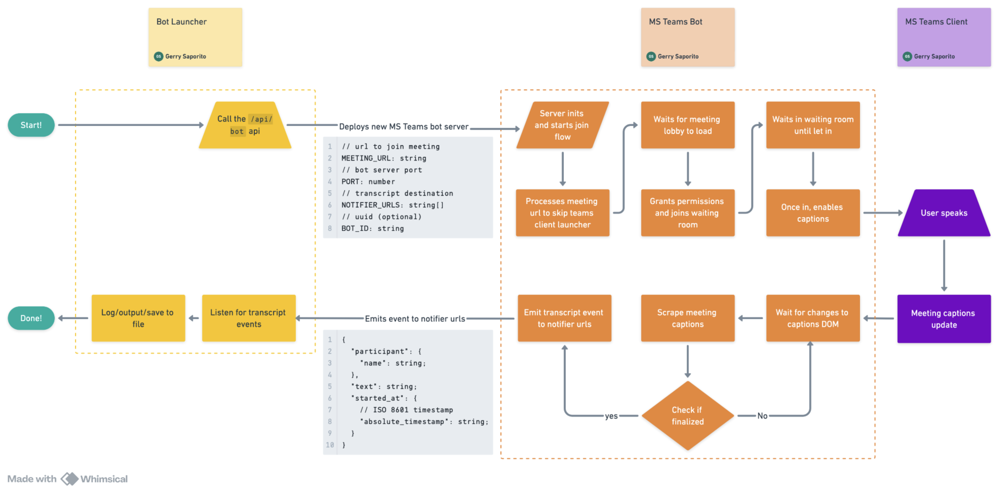

# Open Source Microsoft Teams Meeting Bot

This is an open source Microsoft Teams bot built by Recall.ai. It is designed to be deployed dynamically to join Microsoft Teams meetings, capture transcription data, and forward it to specified webhook or websocket endpoint(s).

## Prerequisites

Before you begin, ensure you have the following installed:

- [Docker](https://docs.docker.com/get-docker/)
- [Docker Compose](https://docs.docker.com/compose/install/)
- [ngrok](https://ngrok.com/download) (for local development)

## Getting Started

1.  **Clone the repository:**

    ```bash
    git clone https://github.com/recallai/microsoft-teams-meeting-bot.git
    cd microsoft-teams-meeting-bot
    ```

2.  **Start ngrok tunnel:**

    Start an ngrok tunnel on port 4100 (or whatever port you configure in `.env`). This exposes your local bot launcher server to the internet so that bot instances can send data back to it.

    ```bash
    ngrok http 4100
    ```

    Copy the public ngrok URL (e.g., `https://abc123.ngrok.io`) - you'll need this for the next step.

3.  **Create and configure `.env` file:**

    Copy the sample environment file:

    ```bash
    cp .env.sample .env
    ```

    Open `.env` and configure the following variables:

    **Required:**

    - `BOT_LAUNCHER_SERVER_PORT`: The port for the launcher server (e.g., `4100`)
    - `MEETING_URL`: The default Teams meeting URL for bots to join
    - `NOTIFIER_URLS`: Comma-separated URLs where bots send data. Use your ngrok URL here:
      ```
      NOTIFIER_URLS=wss://YOUR_NGROK_URL/api/ws/bot,https://YOUR_NGROK_URL/api/wh/bot
      ```

    **⚠️ Important:** Both `deploy-bot` and `run:teams-bot` commands read configs from this `.env` file. If you update the `.env` file, make sure to restart any running services or redeploy bots to pick up the changes. Not updating the `.env` properly may lead to bots trying to connect to old URLs or using incorrect configs.

4.  **Start the Bot Launcher Server:**

    Build and start the launcher server:

    ```bash
    ./scripts.sh up
    ```

    The server will be running on your configured port and accessible via your ngrok URL.

5.  **Deploy a Bot:**

    Use the `deploy-bot` command to launch a bot with your `.env` configs:

    ```bash
    ./scripts.sh deploy-bot
    ```

    This command will:

    - Read `MEETING_URL`, `NOTIFIER_URLS`, and other settings from your `.env`
    - Deploy a new bot instance
    - Automatically start tailing the bot's logs

## Available Commands

This project includes a helper script `./scripts.sh` to manage the application.

**Usage:** `./scripts.sh [COMMAND]`

### Primary Workflow

| Command      | Description                                              |
| ------------ | -------------------------------------------------------- |
| `up`         | Builds and starts services, attaching logs immediately   |
| `deploy-bot` | Deploys a new bot using `.env` config and tails its logs |
| `down`       | Stops all services                                       |

### Other Commands

| Command             | Description                                      |
| ------------------- | ------------------------------------------------ |
| `upd`               | Starts the bot-launcher-server in detached mode  |
| `logs`              | Follows logs from the bot-launcher-server        |
| `logs:bot <BOT_ID>` | Follows logs for a specific teams-bot container  |
| `build`             | Builds all necessary Docker images               |
| `run:teams-bot`     | Runs a standalone teams-bot using `.env` configs |

**Note:** Commands `deploy-bot` and `run:teams-bot` both read from the same `.env` file. Always update your `.env` file and restart services when changing configs to avoid connection issues.

## Deploying via API

You can also deploy bots by calling the launcher's API directly instead of using the `deploy-bot` script.

**Endpoint**: `POST /api/bot`
**Host**: `    "https://YOUR_NGROK_URL/api/wh/bot"`

### Example `curl` Request

```bash
curl -X POST http://localhost:4100/api/bot \
-H "Content-Type: application/json" \
-d '{
  "port": 4102,
  "meetingUrl": "YOUR_TEAMS_MEETING_URL",
  "notifierUrls": [
    "wss://YOUR_NGROK_URL/api/ws/bot",
    "https://YOUR_NGROK_URL/api/wh/bot"
  ],
  "botId": "'$(uuidgen)'"
}'
```

**Important:**

- Replace `YOUR_TEAMS_MEETING_URL` with an actual Teams meeting URL
- Replace `YOUR_NGROK_URL` with your ngrok public URL (e.g., `abc123.ngrok.io`)
- The `notifierUrls` should point to endpoints exposed through your ngrok URL or other external server to receive transcript events
- Using the `deploy-bot` script is recommended as it automatically uses your `.env` configs

## Architecture



The repo architecture is composed of two main dockerized servers:

- **Bot Launcher Server**: This server is responsible for deploying Microsoft Teams bot servers. It exposes an API endpoint to dynamically launch new bot instances. For demonstration purposes, this server is also configured to receive and process the real-time transcription data sent by the bots.

- **Microsoft Teams Bot Server**: Each instance of this server is a bot that joins a specified Microsoft Teams meeting. Its primary functions are to join the meeting, enable the meeting's captions, capture the transcription in real-time, and forward the data to a predefined notifier URL, which, in this setup, is the Bot Launcher Server.

This dual-server setup is designed to mirror a typical production environment for deploying multiple bots.

### Important Files

The core logic for the Microsoft Teams Bot Server is organized into several key files:

- **`apps/teams-bot/src/index.ts`**: The main entry point for the bot server. It initializes the bot and starts the "orchestrator".
- **`apps/teams-bot/src/procedures/orchestrator.ts`**: Coordinates the overall flow and lifecycle of the bot: launching the browser, driving the join sequence, starting captions, tracking state, and shutting down cleanly.
- **`apps/teams-bot/src/procedures/join-procedure.ts`**: Implements the join flow. You'll find the primary methods the orchestrator calls:
  - `startMeetingLauncherFlow(meetingUrl)`: Resolves the Teams meeting URL to the browser join flow and navigates past the launcher dialog.
  - `joinMeetingLobbyFlow()`: Fills in the bot name and clicks "Join now" to enter the lobby.
  - `isInMeetingLobby({ waitForSeconds })`: Checks if the bot is waiting lobby state within the timeout period.
  - `isInMeeting({ waitForSeconds })`: Checks if the bot is in the call within the timeout period.
  - `leaveMeetingFlow()`: Gracefully leaves the meeting when shutting down.
    The "orchestrator" executes these in sequence to progress from: start link → lobby → in-call.
- **`apps/teams-bot/src/procedures/captions-procedure.ts`**: Implements the captions flow. Core methods are:
  - `enableCaptionsFlow()`: Opens the in-call menu and turns on live captions.
  - `subscribeToCaptions()`: Watches the captions DOM for finalized updates and emits transcript events.
    The "orchestrator" calls these after the bot has joined the meeting to start streaming captions.

### Debugging the Teams bot

When running locally, each bot instance writes logs and transcripts to the repository's `output/` directory (paths are relative to where you start the process and are created automatically if missing):

- **Logs**

  - Location: `output/logs/`
  - Filename: `<ISO_TIMESTAMP>-<BOT_ID>.log` (example: `2025-01-02T03:04:05.678Z-<BOT_ID>.log`)

- **Transcripts**
  - Location: `output/transcripts/`
  - Filename: `<ISO_TIMESTAMP>-<BOT_ID>.jsonl`
